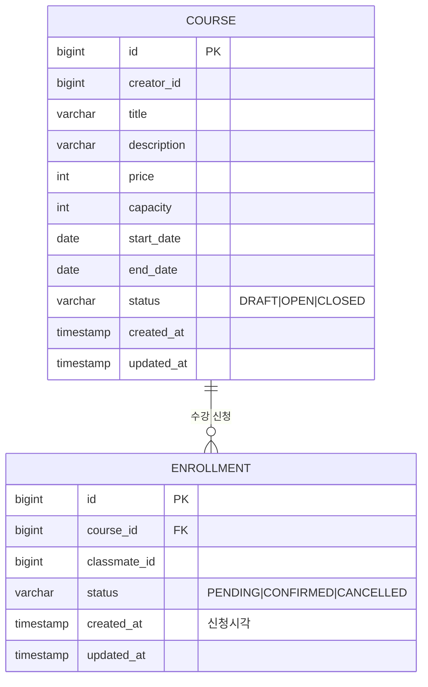

# 과제 A - 수강 신청 시스템

> Backend · CRUD + 비즈니스 규칙
>
> 핵심 키워드: 상태 전이, 정원 관리, 동시성 제어

## 1. 프로젝트 개요

크리에이터가 강의를 개설할 때 수강 정원, 가격, 기간을 설정하면 클래스메이트가 수강 신청을 한다.

정원이 차면 신청이 거부되고, 신청 후 결제가 완료되어야 수강이 확정되고, 수강 취소도 가능하다.

프로젝트 핵심은 마지막 남은 한 자리에 여러 명이 동시에 신청할 때 이를 어떻게 제어하느냐이다.

## 2. 구현 범위

### 필수 구현

1. 강의 관리
    - 강의 등록: 제목, 설명, 가격, 정원, 수강 기간
    - 강의 상태
        - `DRAFT`: 초안 (신청 불가)
        - `OPEN`: 모집 중 (신청 가능)
        - `CLOSED`: 마감 (신청 불가)
    - 강의 목록 조회 (상태 필터 가능)
    - 강의 상세 조회
2. 수강 신청 관리
    - 수강 신청(클래스메이트가 강의 신청)
    - 신청 상태
        - `PENDING`: 신청 완료 및 결제 대기
        - `CONFIRMED`: 결제 완료 및 수강 확정
        - `CANCELLED`: 취소
    - 결제 확정 처리(`PENDING` → `CONFIRMED`)
    - 수강 취소(`PENDING`/`CONFIRMED` → `CANCELLED`)
    - 내 수강 신청 목록 조회
3. 정원 관리 규칙
    - 강의별 최대 정원을 초과한 신청은 거부
    - 동시에 여러 사람이 마지막 자리 신청 시 고려 (동시성 처리)

### 선택 구현

1. 수강 신청 시 취소 가능 기간 제한
2. 대기열 가능
3. 강의별 수강생 목록 조회(크리에이터 전용)
4. 신청 내용 페이지네이션

## 3. 기술 스택

- 언어: Java 21
- 프레임워크: Spring Boot 4.0.6
- ORM: Spring Data JPA
- DB: H2

## 4. 요구사항 해석 및 가정

### 도메인 규칙

1. 인증/인가: `X-User-Id` 헤더(Long)으로 간단히 식별
2. 정원 점유(활성 상태): 신청을 완료했지만 결제는 아직 안 한 `PENDING`과 신청 후 결제까지 완료한 `CONFIRMED`가 자리를 차지한다.
    - `ACTIVE` = `PENDING` + `CONFIRMED`
    - `INACTIVE` = `CANCELLED`
3. 취소 규칙: 활성 상태 시 즉시 취소 가능하고, 취소 시 즉시 점유 해제 (기간 제한은 선택 구현이므로 추후 구현 가능)
    - 취소 후 재신청 가능하다고 가정하여 `CANCELLED` 이력이 있어도 `ACTIVE` 신청이 없으면 허용
4. 결제 확정: `PENDING` → `CONFIRMED` 단순 상태 변경
5. 강의 상태 전이: `DRAFT` → `OPEN` → `CLOSED` (단방향)
    - 강의 신청은 `OPEN`일 때만
    - 상태 변경은 크리에이터(생성자)만
6. 강의 상세 조회 시 활성 신청 인원(`enrolledCount` = `PENDING` + `CONFIRMED`), 정원(`capacity`), 잔여석(`remaining` = `capacity` -
   `enrolledCount`)을 함께 반환한다.
7. 수강 신청 검증 순서: courseId 존재 여부(404) → 강의 `OPEN` 여부(400) → 중복 신청(409) → 정원 초과(409)
8. 역할 검증 없음: 별도 User 엔티티가 없어 크리에이터/클래스메이트 역할을 강제하지 않는다. 동일 사용자가 강의를 만들면서 다른 강의에 신청할 수 있고, 본인 강의에 본인이 신청하는 것도 허용한다(
   소유자 검사는 상태 전이·confirm·cancel에만 적용).
9. 강의 목록 조회 시 `DRAFT`는 기본 제외하며, `X-User-Id` 헤더가 있으면 본인 소유 `DRAFT`만 추가로 포함한다.

### 에러 규약

| HTTP 상태         | 발생 상황                                                                                                                 |
|-----------------|-----------------------------------------------------------------------------------------------------------------------|
| 400 Bad Request | 입력값 검증 실패<br>불법 상태 전이 (Course / Enrollment)<br>`OPEN`이 아닌 강의 신청<br>잘못된 쿼리 파라미터<br>`X-User-Id` 헤더 누락·형식 오류(Long 변환 실패) |
| 403 Forbidden   | 강의 소유자(creator)가 아닌 사용자의 상태 전이 요청<br>신청 소유자(classmate)가 아닌 사용자의 confirm/cancel 요청                                     |
| 404 Not Found   | 존재하지 않는 courseId<br>존재하지 않는 enrollmentId                                                                              |
| 409 Conflict    | 정원 초과: 활성 신청 수 (`PENDING` + `CONFIRMED` >= capacity)<br>중복 신청: 같은 강의에 이미 `PENDING` 또는 `CONFIRMED` 신청 존재               |

**공통 에러 응답 바디** — 모든 4xx 응답은 아래 형식을 따른다.

```json
{
  "code": "COURSE_FULL",
  "message": "정원이 초과되었습니다"
}
```

## 5. 동시성 제어 설계

### 대안 비교

| 구분      | 비관적 락                                             | 낙관적 락                                                               | Redis 분산 락                                              |
|---------|---------------------------------------------------|---------------------------------------------------------------------|---------------------------------------------------------|
| 동작 방식   | 트랜잭션 시작 시 X-Lock으로 대상 행 선점, 커밋/롤백 전까지 후발 트랜잭션 블로킹 | 읽기 시 version 조회, 커밋 시점에 version 불일치 → OptimisticLockException → 재시도 | SETNX + TTL로 락 획득, Pub/Sub으로 해제 감지, Watchdog이 TTL 자동 연장 |
| 충돌 처리   | 대기(블로킹)                                           | 예외 → 애플리케이션 재시도                                                     | 대기(블로킹)                                                 |
| 처리량     | 낮음                                                | 높음                                                                  | 중간                                                      |
| 데드락     | 위험 있음                                             | 없음                                                                  | 없음                                                      |
| 추가 인프라  | 불필요                                               | 불필요                                                                 | Redis 필요                                                |
| 멀티 인스턴스 | DB 공유 시 유효                                        | DB 공유 시 유효                                                          | 완전 지원                                                   |
| 선택 기준   | 높은 충돌 빈도                                          | 낮은 충돌 빈도                                                            | 멀티 인스턴스 환경                                              |
| 적합한 상황  | 수강 신청, 재고 차감, 좌석 예약                               | 프로필 수정, 설정 업데이트                                                     | 쿠폰 발급, 선착순 이벤트                                          |
| 이 과제    | 적합                                                | 재시도 폭풍 위험                                                           | 단일 인스턴스 과잉                                              |

### 비관적 락 선택 이유

다음과 같은 이유로 수강 신청 시스템 동시성 처리로 비관적 락을 선택했다.

- 높은 충돌 빈도: 수강 신청은 인기 강의의 마지막 자리를 다수의 학생이 동시에 노리는 구조로, 같은 행(정원)에 대한 경쟁이 빈번하게 발생한다. 충돌이 드문 상황을 전제하는 낙관적 락과는 적합하지 않다.
- 낙관적 락 배제: 충돌이 많은 환경에서 낙관적 락을 적용하면 `OptimisticLockException` 발생 후 재시도가 반복되어 처리 지연 및 DB 부하가 오히려 증가한다. 수강 신청처럼 경쟁이
  집중되는 도메인에서는 재시도 폭풍이 현실적인 위험이다.
- 강한 일관성 요구: 정원 초과는 비즈니스 규칙상 절대 허용되지 않는다. 비관적 락은 트랜잭션 시작 시점에 행을 선점하여 잔여 정원 확인과 정원 감소를 단일 직렬 흐름으로 처리하므로 초과 등록을 원천
  차단한다.
- 분산 락 배제: 현재 과제는 단일 인스턴스 + 단일 DB 환경으로, Redis 분산 락은 추가 인프라 비용 대비 실익이 없는 과잉 설계다. 스케일아웃이 필요한 시점에 Redisson 기반 분산 락으로
  전환을 고려할 수 있다.

### 구현 시퀀스

수강 신청(`POST /courses/{courseId}/enrollments`)은 단일 쓰기 트랜잭션(`@Transactional`)으로 처리하며, 다음 순서를 따른다.

1. `courseId`로 Course 행을 비관적 쓰기 락으로 조회 (`SELECT ... FOR UPDATE`, JPA `@Lock(PESSIMISTIC_WRITE)`)
2. 강의가 `OPEN` 상태인지 확인 — 아니면 `400`
3. 같은 `classmate_id`의 활성 신청(`PENDING`/`CONFIRMED`) 존재 여부 확인 — 있으면 `409`(중복)
4. 활성 신청 수를 COUNT하여 `capacity`와 비교 — 초과면 `409`(만석)
5. `PENDING` 신청 INSERT 후 커밋

## 6. 데이터 모델

- User는 별도 엔티티 없이 헤더 ID 값으로만 식별하며, Course에서는 `creator_id`, Enrollment에서는 `classmate_id`로 표현한다.
- 활성 중복 신청 방지와 정원 초과 방지는 모두 Course 행 비관적 락 구간 내 검사로 보장한다(인덱스·유니크 제약에 의존하지 않음).



## 7. API 명세

| # | Method | Path                                  | 설명                                | 주체          | 헤더            | 성공  | 주요 실패                      |
|---|--------|---------------------------------------|-----------------------------------|-------------|---------------|-----|----------------------------|
| 1 | POST   | `/courses`                            | 강의 등록(DRAFT)                      | 크리에이터       | X-User-Id     | 201 | 400(검증)                    |
| 2 | PATCH  | `/courses/{courseId}/status`          | 상태 전이                             | 크리에이터(소유자)  | X-User-Id     | 200 | 400(불법전이)·403·404          |
| 3 | GET    | `/courses?status={status}`            | 목록(상태 필터)                         | 누구나         | X-User-Id(선택) | 200 | 400(잘못된 status)            |
| 4 | GET    | `/courses/{courseId}`                 | 상세(현재 신청 인원 포함)                   | 누구나         | —             | 200 | 404                        |
| 5 | POST   | `/courses/{courseId}/enrollments`     | 수강 신청 ★동시성                        | 클래스메이트      | X-User-Id     | 201 | 409(만석/중복)·400(미OPEN)·404  |
| 6 | PATCH  | `/enrollments/{enrollmentId}/confirm` | 결제 확정 PENDING→CONFIRMED           | 클래스메이트(소유자) | X-User-Id     | 200 | 400(PENDING 아닌 경우)·403·404 |
| 7 | PATCH  | `/enrollments/{enrollmentId}/cancel`  | 취소(PENDING/CONFIRMED → CANCELLED) | 클래스메이트(소유자) | X-User-Id     | 200 | 400(이미 취소)·403·404         |
| 8 | GET    | `/enrollments/me`                     | 내 신청 목록(CANCELLED 포함 최신순)         | 클래스메이트      | X-User-Id     | 200 | —                          |

---

### 강의 관리

#### POST /courses

강의 등록. 요청자가 크리에이터가 된다. 초기 상태는 `DRAFT`.

**Request**

```
X-User-Id: 1
```

```json
{
  "title": "스프링 부트 완전 정복",
  "description": "JPA부터 배포까지",
  "price": 99000,
  "capacity": 30,
  "startDate": "2026-07-01",
  "endDate": "2026-08-31"
}
```

**검증 규칙** — 위반 시 `400 Bad Request`

| 필드                      | 제약                                   |
|-------------------------|--------------------------------------|
| `title`                 | 필수, 공백 불가                            |
| `description`           | 선택 (nullable)                        |
| `price`                 | 필수, `0` 이상 (`0` = 무료 허용)             |
| `capacity`              | 필수, `1` 이상                           |
| `startDate` / `endDate` | 필수, `startDate ≤ endDate` (과거 날짜 허용) |

> 검증 실패 응답도 공통 에러 바디 `{ "code": "VALIDATION_FAILED", "message": ... }`를 그대로 사용한다(필드별 `errors[]` 미제공).

**Response** `201 Created`

```json
{
  "id": 1,
  "title": "스프링 부트 완전 정복",
  "description": "JPA부터 배포까지",
  "price": 99000,
  "capacity": 30,
  "startDate": "2026-07-01",
  "endDate": "2026-08-31",
  "status": "DRAFT",
  "creatorId": 1,
  "createdAt": "2026-06-05T09:00:00"
}
```

---

#### GET /courses

강의 목록 조회.

- `status` 쿼리 파라미터로 필터링 가능하며, 생략 시 전체 반환한다. 허용값은 `DRAFT`·`OPEN`·`CLOSED`이며 그 외 값은 `400`.
- 기본 정렬은 `createdAt` 내림차순(최신순).
- `DRAFT` 강의는 기본적으로 제외한다. `X-User-Id` 헤더가 있으면 본인 소유 `DRAFT`만 추가로 포함하고, 없으면 전부 제외한다.
- 응답은 요약 DTO(`id`·`title`·`price`·`capacity`·`status`·`createdAt`)다.

**Request**

```
GET /courses?status=OPEN
```

**Response** `200 OK`

```json
[
  {
    "id": 1,
    "title": "스프링 부트 완전 정복",
    "price": 99000,
    "capacity": 30,
    "status": "OPEN",
    "createdAt": "2026-06-05T09:00:00"
  }
]
```

---

#### GET /courses/{courseId}

강의 상세 조회.

**Response** `200 OK`

```json
{
  "id": 1,
  "title": "스프링 부트 완전 정복",
  "description": "JPA부터 배포까지",
  "price": 99000,
  "capacity": 30,
  "startDate": "2026-07-01",
  "endDate": "2026-08-31",
  "status": "OPEN",
  "creatorId": 1,
  "enrolledCount": 12,
  "remaining": 18,
  "createdAt": "2026-06-05T09:00:00"
}
```

> `enrolledCount` = 활성 신청 수(`PENDING` + `CONFIRMED`), `remaining` = `capacity` - `enrolledCount`.

| 상황         | 응답              |
|------------|-----------------|
| 존재하지 않는 강의 | `404 Not Found` |

---

#### PATCH /courses/{courseId}/status

강의 상태 변경. `DRAFT → OPEN → CLOSED` 단방향 전이만 허용.

**Request**

```
X-User-Id: 1
```

```json
{
  "status": "OPEN"
}
```

**Response** `200 OK` — 변경 결과는 최소 필드(`id`·`status`)만 반환한다.

```json
{
  "id": 1,
  "status": "OPEN"
}
```

| 상황                           | 응답                |
|------------------------------|-------------------|
| 소유자가 아닌 경우                   | `403 Forbidden`   |
| 허용되지 않는 전이 (예: OPEN → DRAFT) | `400 Bad Request` |
| 존재하지 않는 강의                   | `404 Not Found`   |

---

### 수강 신청 관리

#### POST /courses/{courseId}/enrollments

수강 신청. 요청자가 클래스메이트가 된다. 초기 상태는 `PENDING`.

**Request**

```
X-User-Id: 100
```

**Response** `201 Created`

```json
{
  "id": 1,
  "courseId": 1,
  "classmateId": 100,
  "status": "PENDING",
  "createdAt": "2026-06-05T10:00:00",
  "updatedAt": "2026-06-05T10:00:00"
}
```

> Enrollment 응답 DTO는 `createdAt`·`updatedAt`을 항상 포함하며, 생성 시 두 값은 동일하다.

| 상황                              | 응답                |
|---------------------------------|-------------------|
| 정원 초과                           | `409 Conflict`    |
| 이미 활성 신청 존재 (PENDING/CONFIRMED) | `409 Conflict`    |
| OPEN 상태가 아닌 강의                  | `400 Bad Request` |
| 존재하지 않는 강의                      | `404 Not Found`   |

---

#### PATCH /enrollments/{enrollmentId}/confirm

결제 확정. `PENDING → CONFIRMED` 상태 변경. 검사 순서: 신청 존재(404) → 소유자(403) → 상태(400).

**Request**

```
X-User-Id: 100
```

**Response** `200 OK`

```json
{
  "id": 1,
  "courseId": 1,
  "classmateId": 100,
  "status": "CONFIRMED",
  "createdAt": "2026-06-05T10:00:00",
  "updatedAt": "2026-06-05T10:05:00"
}
```

| 상황                | 응답                |
|-------------------|-------------------|
| 소유자가 아닌 경우        | `403 Forbidden`   |
| PENDING 상태가 아닌 경우 | `400 Bad Request` |
| 존재하지 않는 신청        | `404 Not Found`   |

---

#### PATCH /enrollments/{enrollmentId}/cancel

수강 취소. `PENDING` 또는 `CONFIRMED → CANCELLED` 상태 변경. 취소 시 즉시 정원 해제. 검사 순서: 신청 존재(404) → 소유자(403) → 상태(400).

**Request**

```
X-User-Id: 100
```

**Response** `200 OK`

```json
{
  "id": 1,
  "courseId": 1,
  "classmateId": 100,
  "status": "CANCELLED",
  "createdAt": "2026-06-05T10:00:00",
  "updatedAt": "2026-06-05T10:10:00"
}
```

| 상황         | 응답                |
|------------|-------------------|
| 소유자가 아닌 경우 | `403 Forbidden`   |
| 이미 취소된 신청  | `400 Bad Request` |
| 존재하지 않는 신청 | `404 Not Found`   |

---

#### GET /enrollments/me

내 수강 신청 목록 조회. `CANCELLED` 포함, `createdAt` 내림차순(최신순) 정렬. 응답의 `courseTitle`은 Course 조인으로 채운다(fetch join 또는 DTO
projection으로 N+1 회피).

**Request**

```
X-User-Id: 100
```

**Response** `200 OK`

```json
[
  {
    "id": 1,
    "courseId": 1,
    "courseTitle": "스프링 부트 완전 정복",
    "status": "CONFIRMED",
    "createdAt": "2026-06-05T10:00:00"
  }
]
```

## 8. 실행 및 테스트

### 실행 방법

```bash
./gradlew bootRun
```

- 기본 포트: `8080`
- DB: 인메모리 H2 (애플리케이션 기동 시 스키마 자동 생성, 종료 시 소멸)
- H2 콘솔: `http://localhost:8080/h2-console` (JDBC URL `jdbc:h2:mem:testdb`, user `sa`, password 없음)

### 테스트 실행 방법

```bash
./gradlew test
```

**현재 테스트 구성**

| 테스트              | 위치                                 | 검증 내용                                                                      |
|------------------|------------------------------------|----------------------------------------------------------------------------|
| `CourseTest`     | `course/domain/CourseTest`         | 강의 상태 전이(`DRAFT`→`OPEN`→`CLOSED`) 도메인 규칙과 불법 전이 예외, 소유자 판별                 |
| `EnrollmentTest` | `enrollment/domain/EnrollmentTest` | 신청 상태 전이(`PENDING`→`CONFIRMED`/`CANCELLED`) 규칙과 불법 전이 예외, 소유자 판별, 활성 여부 판별 |

## 9. AI 활용 범위

**사용 도구:** Claude Code

1. 설계 및 명세 정리
    - 도메인 규칙, 에러 규약, API 명세를 AI와 함께 설계하며 트레이드오프를 검토하고, 최종 결정은 직접 내렸습니다.
2. TDD 구현
    - 상태 전이·정원 관리·동시성 제어 같은 주요 로직은 빨강 → 초록 사이클(TDD)로 코드를 직접 작성했고, AI는 단계 안내만 담당했습니다.
3. 커밋 전 점검
    - 커밋 전 4단계를 순서대로 거쳤습니다. "올바른 걸 만들었나 → 올바르게 만들었나 → 깔끔하게 만들었나". 1·2는 편향을 줄이려 독립 에이전트로 점검(보고)하고, 수정은 AI가 적용한 뒤 직접
      검토했습니다.
        1. 스펙 대조: 구현이 README 스펙과 일치하는지 대조하여 방향 오류를 가장 먼저 차단.
        2. 코드 리뷰(`/code-review`): 버그, 엣지케이스, 정확성 점검.
        3. 단순화(`/simplify`): 중복, 복잡도 정리.
        4. 전체 테스트: 위 수정 및 정리를 반영한 뒤 `./gradlew test`가 전부 green인지 확인하고, 실패 시 커밋을 보류.
4. 커밋 메시지
    - 변경 내용을 바탕으로 AI가 초안을 제시하면, 직접 검토 후 수정해 커밋했습니다.
