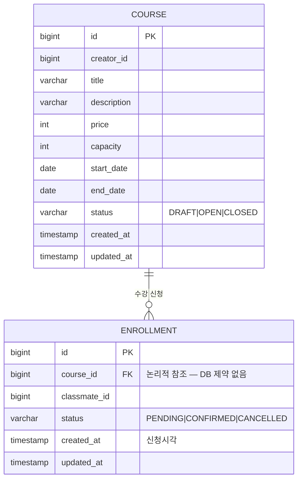

# 과제 A - 수강 신청 시스템

> Backend: CRUD + 비즈니스 규칙
>
> 핵심 키워드: 상태 전이, 정원 관리, 동시성 제어

## 목차

1. [프로젝트 개요](#1-프로젝트-개요)
2. [구현 범위](#2-구현-범위)
3. [기술 스택 및 구조](#3-기술-스택-및-구조)
4. [요구사항 해석 및 가정](#4-요구사항-해석-및-가정)
5. [설계 결정과 이유](#5-설계-결정과-이유)
6. [데이터 모델 설명](#6-데이터-모델-설명)
7. [API 목록 및 예시](#7-api-목록-및-예시)
8. [실행 및 테스트](#8-실행-및-테스트)
9. [미구현 / 제약사항](#9-미구현--제약사항)
10. [AI 활용 범위](#10-ai-활용-범위)

## 1. 프로젝트 개요

크리에이터(강사)가 강의를 열고 정원, 가격, 기간을 정하면, 클래스메이트(수강생)가 원하는 강의에 수강 신청을 한다.

정원이 차면 신청은 거부된다. 결제를 마치면 수강이 확정되고, 신청 및 확정 건은 취소할 수 있다.

이 과제의 핵심은 마지막 한 자리를 두고 여러 명이 경쟁할 때 동시성을 어떻게 처리하느냐이다.

## 2. 구현 범위

### 필수 구현

1. 강의 관리
    - 강의 등록: 제목, 설명, 가격, 정원, 수강 기간(시작일/종료일)
    - 강의 상태
        - `DRAFT`: 초안 (신청 불가)
        - `OPEN`: 모집 중 (신청 가능)
        - `CLOSED`: 마감 (신청 불가)
    - 강의 목록 조회 (상태 필터 가능)
    - 강의 상세 조회
2. 수강 신청 관리
    - 수강 신청(클래스메이트가 강의 신청)
    - 신청 상태
        - `PENDING`: 신청 완료 및 결제 대기
        - `CONFIRMED`: 결제 완료 및 수강 확정
        - `CANCELLED`: 취소
    - 결제 확정 처리(`PENDING` → `CONFIRMED`)
    - 수강 취소(`PENDING`/`CONFIRMED` → `CANCELLED`)
    - 내 수강 신청 목록 조회
3. 정원 관리 규칙
    - 강의별 최대 정원을 초과한 신청은 거부
    - 동시에 여러 사람이 마지막 자리 신청 시 동시성 처리

### 선택 구현

1. 수강 신청 시 취소 가능 기간 제한
2. 대기열 기능
3. 강의별 수강생 목록 조회(크리에이터 전용)
4. 신청 내역 페이지네이션

## 3. 기술 스택 및 구조

- 언어: Java 21
- 프레임워크: Spring Boot 4.0.6
- ORM: Spring Data JPA
- DB: H2

### 패키지 구조

```
src/main/java/hello/courseregistration
├── common
│   ├── exception   # ApiException/ErrorCode/GlobalExceptionHandler
│   └── response    # ErrorResponse
├── course          # 강의 도메인
│   └── controller/service/repository/domain/dto
└── enrollment      # 수강 신청 도메인
    └── controller/service/repository/domain/dto
```

## 4. 요구사항 해석 및 가정

### 도메인 규칙

1. 인증/인가: `X-User-Id` 헤더(Long)로 간단히 식별
2. 정원 점유(활성 상태): `PENDING`(신청, 결제 대기)과 `CONFIRMED`(결제 완료)가 자리를 차지한다.
    - 활성 = `PENDING` + `CONFIRMED`, 비활성 = `CANCELLED` (별도 상태값이 아닌 분류 개념)
3. 취소 규칙: 활성 상태면 즉시 취소할 수 있고, 취소 시 즉시 점유를 해제한다.
    - 취소 후 재신청은 활성 신청이 없으면 허용한다(`CANCELLED` 이력 무관).
4. 결제 확정: `PENDING` → `CONFIRMED`로 바꾸는 단순 상태 변경이다.
    - 신청 상태 전이
        - `PENDING` → `CONFIRMED`(confirm)
        - `PENDING`/`CONFIRMED` → `CANCELLED`(cancel)
        - 그 외 전이는 불법으로 `400`을 반환한다.
    - 결제 확정과 취소는 신청(Enrollment) 상태만 검사한다. 강의가 `CLOSED`로 마감된 뒤에도 기존 신청의 confirm/cancel은 가능하다(마감 = 신규 신청 차단).
5. 강의 상태 전이: `DRAFT` → `OPEN` → `CLOSED` (단방향)
    - 강의 신청은 `OPEN`일 때만 가능
    - 상태 변경은 크리에이터(생성자)만 가능
6. 강의 상세 조회 시 다음을 함께 반환
    - 활성 신청 인원(`enrolledCount` = `PENDING` + `CONFIRMED`)
    - 정원(`capacity`)
    - 잔여석(`remaining` = `capacity` - `enrolledCount`)
7. 수강 신청 검증 순서: courseId 존재 여부(404) → 강의 `OPEN` 여부(400) → 중복 신청(409) → 정원 초과(409)
8. 역할 검증 없음: 별도 User 엔티티 없이 크리에이터/클래스메이트 역할을 강제하지 않는다.
    - 본인 강의에 본인이 신청하는 것도 허용한다(소유자 검사는 상태 전이, confirm, cancel에만 적용).
9. 목록 조회는 공개 목록
    - `DRAFT`(초안)는 목록에 노출하지 않고 `status` 필터 값으로도 허용하지 않는다(요청 시 `400`). 초안은 상세 조회로만 접근한다.
    - `OPEN`과 `CLOSED` 상태의 강의 목록은 누구나 확인할 수 있다.

### 에러 규약

| HTTP 상태         | 에러 코드                      | 발생 상황                                                                                                       |
|-----------------|----------------------------|-------------------------------------------------------------------------------------------------------------|
| 400 Bad Request | `VALIDATION_FAILED`        | 입력값 검증 실패(필드 단위, `errors[]`에 상세)                                                                            |
| 400 Bad Request | `INVALID_REQUEST`          | 교차검증 위반(시작일 > 종료일)<br>잘못된 쿼리 파라미터<br>`X-User-Id` 헤더 누락이나 형식 오류(Long 변환 실패)<br>요청 본문 파싱 실패(깨진 JSON이나 잘못된 enum 값) |
| 400 Bad Request | `INVALID_STATE_TRANSITION` | 불법 상태 전이 (Course / Enrollment)                                                                              |
| 400 Bad Request | `COURSE_NOT_OPEN`          | `OPEN`이 아닌 강의 신청                                                                                            |
| 403 Forbidden   | `FORBIDDEN`                | 강의 소유자(creator)가 아닌 사용자의 상태 전이 요청<br>신청 소유자(classmate)가 아닌 사용자의 confirm/cancel 요청                           |
| 404 Not Found   | `COURSE_NOT_FOUND`         | 존재하지 않는 courseId                                                                                            |
| 404 Not Found   | `ENROLLMENT_NOT_FOUND`     | 존재하지 않는 enrollmentId                                                                                        |
| 409 Conflict    | `COURSE_FULL`              | 정원 초과: 활성 신청 수(`PENDING` + `CONFIRMED`) ≥ capacity                                                          |
| 409 Conflict    | `DUPLICATE_ENROLLMENT`     | 중복 신청: 같은 강의에 이미 `PENDING`/`CONFIRMED` 신청 존재                                                                |

### 공통 에러 응답 바디

```json
{
  "code": "COURSE_FULL",
  "message": "정원이 초과되었습니다",
  "errors": []
}
```

## 5. 설계 결정과 이유

### 5-1. 동시성 제어: 비관적 락

#### 대안 비교

| 구분     | 비관적 락                                                   | 낙관적 락                                                               |
|--------|---------------------------------------------------------|---------------------------------------------------------------------|
| 동작 방식  | 트랜잭션 시작 시 X-Lock(배타 락)으로 대상 행 선점, 커밋/롤백 전까지 후발 트랜잭션 블로킹 | 읽기 시 version 조회, 커밋 시점에 version 불일치 → OptimisticLockException → 재시도 |
| 충돌 처리  | 대기(블로킹)                                                 | 예외 → 애플리케이션 재시도                                                     |
| 처리량    | 낮음                                                      | 높음                                                                  |
| 데드락    | 위험 있음                                                   | 없음                                                                  |
| 선택 기준  | 높은 충돌 빈도                                                | 낮은 충돌 빈도                                                            |
| 적합한 상황 | 수강 신청, 재고 차감, 좌석 예약                                     | 프로필 수정, 설정 업데이트                                                     |
| 이 과제   | 적합                                                      | 재시도 폭풍 위험                                                           |

> 멀티 인스턴스 환경이라면 Redis 등 분산 락도 후보지만, 이 과제는 단일 인스턴스에 단일 DB라 과한 설계다.

#### 비관적 락 선택 이유

수강 신청 동시성 제어로 비관적 락을 선택한 이유는 다음과 같다.

1. 높은 충돌 빈도
    - 인기 강의의 마지막 한 자리를 여러 명이 동시에 노린다. 같은 행(정원)에 경쟁이 몰리므로, 충돌이 드물다고 전제하는 낙관적 락과는 맞지 않는다.
    - 낙관적 락으로 처리 시 충돌이 잦으면 `OptimisticLockException`으로 재시도가 반복돼 오히려 느려지고 DB 부하만 커진다.
2. 강한 일관성
    - 정원 초과는 절대 허용되면 안 되기에 비관적 락으로 행을 먼저 잠그고 '확인 → 등록'을 한 트랜잭션에서 원자적으로 처리해 초과 등록을 막는다.
3. 분산 락 배제
    - 단일 인스턴스에 단일 DB 환경이라 분산 락(Redis 등)은 과한 설계다. 멀티 인스턴스로 확장하면 그때 분산 락을 검토할 수 있다.

#### 구현 시퀀스

수강 신청(`POST /courses/{courseId}/enrollments`)은 단일 트랜잭션(`@Transactional`)으로 다음 순서를 따른다.

1. `courseId`로 Course 행을 비관적 쓰기 락으로 조회 (`SELECT ... FOR UPDATE`, JPA `@Lock(PESSIMISTIC_WRITE)`)
2. 강의가 `OPEN` 상태인지 확인 — 아니면 `400`
3. 같은 `classmate_id`의 활성 신청(`PENDING`/`CONFIRMED`) 존재 여부 확인 — 있으면 `409`(중복)
4. 활성 신청 수를 COUNT하여 `capacity`와 비교 — 초과면 `409`(정원 초과)
5. `PENDING` 신청 INSERT 후 커밋

#### 데드락과 격리 수준

- 트랜잭션당 Course 1건만 한 지점에서 잠그므로, 락 교차 획득에 의한 데드락이 없다.
- 정합성은 격리 수준이 아니라 X-Lock에 의존한다 — READ_COMMITTED에서도 후발 트랜잭션이 같은 행에서 블로킹되어 '확인 → 등록'이 직렬화된다.

### 5-2. 예외 처리: ApiException + ErrorCode

- 예외는 `ApiException` 하나로, HTTP 상태/코드/메시지는 `ErrorCode` enum이 갖는다. 비즈니스 예외 핸들러도 하나다.
- 응답은 공통 에러 바디로 통일하고, 검증 실패만 `errors[]`에 필드 상세를 담는다.

### 5-3. 내 신청 목록 조회: N+1 회피

#### 문제: 연관관계 없는 조인

- `GET /enrollments/me`는 신청마다 강의 제목(`courseTitle`)을 함께 반환한다.
- 그런데 `Enrollment`는 `Course`와 객체 연관관계 없이 `course_id`(FK 값)만 가진다(6. 데이터 모델 참고).
- 가장 단순한 구현은 신청 목록을 조회한 뒤 각 항목마다 `courseRepository.findById(courseId)`로 제목을 채우는 것인데, 이러면 목록 1번 + 항목 N번 = N+1 쿼리가
  발생한다.

```
단순 구현:  SELECT ... FROM enrollment WHERE classmate_id = ?      -- 1
            SELECT ... FROM course WHERE id = ?   (신청 1건)        -- +1
            SELECT ... FROM course WHERE id = ?   (신청 2건)        -- +1
            ...                                   (신청 N건)        -- +N
            => 1 + N 쿼리

조인:       SELECT e.*, c.title FROM enrollment e
            JOIN course c ON c.id = e.course_id
            WHERE e.classmate_id = ? ORDER BY e.created_at DESC     -- 1
            => 1 쿼리
```

#### 선택: JPQL JOIN (생성자 표현식 projection)

- 같은 DB 안이면 **JOIN이 1순위**다. SQL 레벨에서 끝나 추가 네트워크 왕복이 없고 가장 단순하다.
- 이 과제는 `Enrollment`와 `Course`가 같은 DB에 있고 조인이 단순하므로 JPQL 생성자 표현식이 가장 적절하다고 판단했다. (조인이 불가능하거나 컬렉션을 로딩할 때는 IN절 배치가 대안이다.)

**구현: before / after**

```text
// before — 서비스에서 신청을 조회한 뒤, 항목마다 Course를 다시 조회 (N+1)
return enrollmentRepository.findByClassmateIdOrderByCreatedAtDesc(classmateId).stream()
        .map(e -> {
            // 신청마다 +1 쿼리
            String courseTitle = courseRepository.findById(e.getCourseId())
                    .map(Course::getTitle).orElse(null);
            return new MyEnrollmentResponse(
                    e.getId(), e.getCourseId(), courseTitle, e.getStatus(), e.getCreatedAt());
        })
        .toList();
```

```text
// after — 조인 projection 한 번으로 courseTitle까지 채워 반환 (1 쿼리)
@Query("""
        select new hello.courseregistration.enrollment.dto.response.MyEnrollmentResponse(
            e.id, e.courseId, c.title, e.status, e.createdAt)
        from Enrollment e join Course c on c.id = e.courseId
        where e.classmateId = :classmateId
        order by e.createdAt desc
        """)
List<MyEnrollmentResponse> findMyEnrollments(@Param("classmateId") Long classmateId);

// service — 위임만
return enrollmentRepository.findMyEnrollments(classmateId);
```

**결과: before / after** (신청 12건 조회 기준)

| 구분     | 조회 쿼리 수       | 비고                                                   |
|--------|---------------|------------------------------------------------------|
| before | `13` (1 + 12) | 신청 수 N에 정비례해 증가(`1 + N`) — 이론값                       |
| after  | `1`           | 신청 수와 무관하게 단일 조인 쿼리 — `MyEnrollmentNPlusOneTest`로 검증 |

### 5-4. 도메인 간 의존

- `CourseService`는 상세 조회의 `enrolledCount` 집계를 위해 `EnrollmentRepository`를, `EnrollmentService`는 정원 검사와 락을 위해 `CourseRepository`를 직접 호출한다.
- 두 도메인이 같은 트랜잭션 경계와 같은 DB 안에 있고 cross-domain 호출이 단순 read이므로, 별도 조회 서비스를 두기보다 read 목적의 cross-repository 호출을 허용해 단순함을 택했다. 멀티 인스턴스나 복잡도 증가 시 조회 전용 서비스로 분리할 수 있다.

## 6. 데이터 모델 설명

- User는 별도 엔티티 없이 헤더 ID 값으로만 식별하며, Course에서는 `creator_id`, Enrollment에서는 `classmate_id`로 표현한다.
- `course_id`는 논리적 참조다. JPA 연관관계 없이 ID 값만 보관하며(5-3), DB 레벨 FK 제약은 두지 않았다.



## 7. API 목록 및 예시

| #                                            | Method | Path                                  | 설명                                      | 주체          | 헤더        | 성공  | 주요 실패                            |
|----------------------------------------------|--------|---------------------------------------|-----------------------------------------|-------------|-----------|-----|----------------------------------|
| [1](#1-post-courses)                         | POST   | `/courses`                            | 강의 등록(`DRAFT`)                          | 크리에이터       | X-User-Id | 201 | 400(검증)                          |
| [2](#2-get-courses)                          | GET    | `/courses?status={status}`            | 목록(상태 필터: `OPEN`/`CLOSED`)              | 누구나         | —         | 200 | 400(`DRAFT`/잘못된 status)          |
| [3](#3-get-coursescourseid)                  | GET    | `/courses/{courseId}`                 | 상세(현재 신청 인원 포함)                         | 누구나         | —         | 200 | 404                              |
| [4](#4-patch-coursescourseidstatus)          | PATCH  | `/courses/{courseId}/status`          | 상태 전이                                   | 크리에이터(소유자)  | X-User-Id | 200 | 400(검증/불법 전이)/403/404            |
| [5](#5-post-coursescourseidenrollments)      | POST   | `/courses/{courseId}/enrollments`     | 수강 신청 ★동시성                              | 클래스메이트      | X-User-Id | 201 | 409(중복/정원 초과)/400(`OPEN` 아님)/404 |
| [6](#6-patch-enrollmentsenrollmentidconfirm) | PATCH  | `/enrollments/{enrollmentId}/confirm` | 결제 확정(`PENDING` → `CONFIRMED`)          | 클래스메이트(소유자) | X-User-Id | 200 | 400(`PENDING` 아님)/403/404        |
| [7](#7-patch-enrollmentsenrollmentidcancel)  | PATCH  | `/enrollments/{enrollmentId}/cancel`  | 취소(`PENDING`/`CONFIRMED` → `CANCELLED`) | 클래스메이트(소유자) | X-User-Id | 200 | 400(이미 취소)/403/404               |
| [8](#8-get-enrollmentsme)                    | GET    | `/enrollments/me`                     | 내 신청 목록(`CANCELLED` 포함 최신순)             | 클래스메이트      | X-User-Id | 200 | —                                |

---

### 강의 관리

#### 1. POST /courses

강의 등록. 요청자가 크리에이터가 된다. 초기 상태는 `DRAFT`.

**Request**

```
X-User-Id: 1
```

```json
{
  "title": "스프링 부트 완전 정복",
  "description": "JPA부터 배포까지",
  "price": 99000,
  "capacity": 30,
  "startDate": "2026-07-01",
  "endDate": "2026-08-31"
}
```

**검증 규칙** — 위반 시 `400 Bad Request`

| 필드                      | 제약                                   |
|-------------------------|--------------------------------------|
| `title`                 | 필수, 공백 불가                            |
| `description`           | 선택 (nullable)                        |
| `price`                 | 필수, `0` 이상 (`0` = 무료 허용)             |
| `capacity`              | 필수, `1` 이상                           |
| `startDate` / `endDate` | 필수, `startDate ≤ endDate` (과거 날짜 허용) |

> 단일 필드 검증 실패 응답은 공통 에러 바디의 `errors[]`에 필드별 상세를 담아 반환한다.
> 단, 필드 간 교차검증(`startDate ≤ endDate`) 위반은 `INVALID_REQUEST` 코드와 빈 `errors[]`로 반환한다.
>
> 단일 필드 검증 실패 예시:
>
> ```json
> {
>   "code": "VALIDATION_FAILED",
>   "message": "입력값 검증에 실패했습니다",
>   "errors": [
>     { "field": "title", "message": "제목은 필수입니다" }
>   ]
> }
> ```

**Response** `201 Created`

```json
{
  "id": 1,
  "title": "스프링 부트 완전 정복",
  "description": "JPA부터 배포까지",
  "price": 99000,
  "capacity": 30,
  "startDate": "2026-07-01",
  "endDate": "2026-08-31",
  "status": "DRAFT",
  "creatorId": 1,
  "createdAt": "2026-06-05T09:00:00"
}
```

---

#### 2. GET /courses

강의 목록 조회.

- `status` 쿼리 파라미터로 필터링 가능하며, 생략 시 `DRAFT`를 제외한 전체(`OPEN`, `CLOSED`)를 반환한다.
- 허용값은 `OPEN`과 `CLOSED`. `DRAFT` 및 그 외 값은 `400`으로 거부한다(초안은 상세 조회로만 접근).
- 기본 정렬은 `createdAt` 내림차순(최신순).
- 응답은 요약 DTO(`id`, `title`, `price`, `capacity`, `status`, `createdAt`)다.

**Request**

```
GET /courses?status=OPEN
```

**Response** `200 OK`

```json
[
  {
    "id": 1,
    "title": "스프링 부트 완전 정복",
    "price": 99000,
    "capacity": 30,
    "status": "OPEN",
    "createdAt": "2026-06-05T09:00:00"
  }
]
```

---

#### 3. GET /courses/{courseId}

강의 상세 조회.

**Response** `200 OK`

```json
{
  "id": 1,
  "title": "스프링 부트 완전 정복",
  "description": "JPA부터 배포까지",
  "price": 99000,
  "capacity": 30,
  "startDate": "2026-07-01",
  "endDate": "2026-08-31",
  "status": "OPEN",
  "creatorId": 1,
  "enrolledCount": 12,
  "remaining": 18,
  "createdAt": "2026-06-05T09:00:00"
}
```

> `enrolledCount` = 활성 신청 수(`PENDING` + `CONFIRMED`), `remaining` = `capacity` - `enrolledCount`.

| 상황         | 응답              |
|------------|-----------------|
| 존재하지 않는 강의 | `404 Not Found` |

---

#### 4. PATCH /courses/{courseId}/status

강의 상태 변경. `DRAFT` → `OPEN` → `CLOSED` 단방향 전이만 허용.

**Request**

```
X-User-Id: 1
```

```json
{
  "status": "OPEN"
}
```

**Response** `200 OK` — 변경 결과는 최소 필드(`id`, `status`)만 반환한다.

```json
{
  "id": 1,
  "status": "OPEN"
}
```

| 상황                               | 응답                |
|----------------------------------|-------------------|
| 소유자가 아닌 경우                       | `403 Forbidden`   |
| 허용되지 않는 전이 (예: `OPEN` → `DRAFT`) | `400 Bad Request` |
| 존재하지 않는 강의                       | `404 Not Found`   |

---

### 수강 신청 관리

#### 5. POST /courses/{courseId}/enrollments

수강 신청. 요청자가 클래스메이트가 된다. 초기 상태는 `PENDING`.

**Request**

```
X-User-Id: 100
```

**Response** `201 Created`

```json
{
  "id": 1,
  "courseId": 1,
  "classmateId": 100,
  "status": "PENDING",
  "createdAt": "2026-06-05T10:00:00",
  "updatedAt": "2026-06-05T10:00:00"
}
```

> 신청 생성, 확정, 취소 응답은 `createdAt`과 `updatedAt`을 포함한다. 내 신청 목록(8번)은 요약 DTO라 `updatedAt`을 제외했다.

| 상황                                  | 응답                |
|-------------------------------------|-------------------|
| 정원 초과                               | `409 Conflict`    |
| 이미 활성 신청 존재 (`PENDING`/`CONFIRMED`) | `409 Conflict`    |
| `OPEN` 상태가 아닌 강의                    | `400 Bad Request` |
| 존재하지 않는 강의                          | `404 Not Found`   |

---

#### 6. PATCH /enrollments/{enrollmentId}/confirm

결제 확정. `PENDING` → `CONFIRMED` 상태 변경. 검증 순서: 신청 존재(404) → 소유자(403) → 상태(400).

**Request**

```
X-User-Id: 100
```

**Response** `200 OK`

```json
{
  "id": 1,
  "courseId": 1,
  "classmateId": 100,
  "status": "CONFIRMED",
  "createdAt": "2026-06-05T10:00:00",
  "updatedAt": "2026-06-05T10:00:00"
}
```

| 상황                  | 응답                |
|---------------------|-------------------|
| 소유자가 아닌 경우          | `403 Forbidden`   |
| `PENDING` 상태가 아닌 경우 | `400 Bad Request` |
| 존재하지 않는 신청          | `404 Not Found`   |

---

#### 7. PATCH /enrollments/{enrollmentId}/cancel

수강 취소. `PENDING`/`CONFIRMED` → `CANCELLED` 상태 변경. 취소 시 즉시 정원 해제. 검증 순서: 신청 존재(404) → 소유자(403) → 상태(400).

**Request**

```
X-User-Id: 100
```

**Response** `200 OK`

```json
{
  "id": 1,
  "courseId": 1,
  "classmateId": 100,
  "status": "CANCELLED",
  "createdAt": "2026-06-05T10:00:00",
  "updatedAt": "2026-06-05T10:00:00"
}
```

| 상황         | 응답                |
|------------|-------------------|
| 소유자가 아닌 경우 | `403 Forbidden`   |
| 이미 취소된 신청  | `400 Bad Request` |
| 존재하지 않는 신청 | `404 Not Found`   |

---

#### 8. GET /enrollments/me

내 수강 신청 목록 조회. `CANCELLED` 포함, `createdAt` 내림차순(최신순) 정렬. 응답의 `courseTitle`은 Course 조인 DTO projection 한 번으로 채워 N+1을
회피한다(5-3).

**Request**

```
X-User-Id: 100
```

**Response** `200 OK`

```json
[
  {
    "id": 1,
    "courseId": 1,
    "courseTitle": "스프링 부트 완전 정복",
    "status": "CONFIRMED",
    "createdAt": "2026-06-05T10:00:00"
  }
]
```

## 8. 실행 및 테스트

### 실행 방법

```bash
./gradlew bootRun
```

- 기본 포트: `8080`
- DB: 인메모리 H2 (애플리케이션 기동 시 스키마 자동 생성, 종료 시 소멸)
- H2 콘솔: `http://localhost:8080/h2-console` (JDBC URL `jdbc:h2:mem:testdb`, user `sa`, password 없음)
- API 샘플 요청: `http/` 디렉터리의 `.http` 파일 — IntelliJ HTTP Client로 바로 실행 가능 (구현된 기능의 정상 요청 샘플, 실패 케이스는 테스트 코드가 담당)

### 테스트 실행 방법

```bash
./gradlew test
```

핵심인 동시성 테스트만 따로 실행하려면:

```bash
./gradlew test --tests '*EnrollmentConcurrencyTest'
```

> `show-sql=true`가 켜져 있어, 수강 신청 시 비관적 쓰기 락 쿼리(`select ... for update`)가 나가는 것을 콘솔 로그에서 직접 확인할 수 있다.

**현재 테스트 구성**

| 테스트                         | 위치                      | 유형                | 검증 내용                                                                                              |
|-----------------------------|-------------------------|-------------------|----------------------------------------------------------------------------------------------------|
| `CourseTest`                | `course/domain`         | 단위                | 상태 전이(`DRAFT` → `OPEN` → `CLOSED`), 불법 전이 예외, 상태 변경 분기(`changeStatusTo`), 소유자 판별, 기간 불변식(시작일 ≤ 종료일) |
| `EnrollmentTest`            | `enrollment/domain`     | 단위                | 신청 상태 전이(`PENDING` → `CONFIRMED`/`CANCELLED`), 불법 전이 예외, 소유자 판별                                      |
| `CourseRepositoryTest`      | `course/repository`     | `@DataJpaTest`    | 공개 목록 `DRAFT` 제외, `createdAt` 내림차순 정렬, 상태 필터 파생 쿼리                                                 |
| `EnrollmentRepositoryTest`  | `enrollment/repository` | `@DataJpaTest`    | 활성 신청(`PENDING`+`CONFIRMED`) 집계와 활성 중복 판별, 내 신청 목록 조인 조회(`courseTitle`, 최신순)                         |
| `CourseCreateApiTest`       | `course/controller`     | `@SpringBootTest` | 강의 등록 API 통합 — 정상 201 응답 셰이프, 검증 실패 `VALIDATION_FAILED`+`errors[]`, 교차검증 `INVALID_REQUEST`        |
| `CourseListApiTest`         | `course/controller`     | `@SpringBootTest` | 목록 조회 API 통합 — 상태 필터, `DRAFT`/잘못된 값 400, 요약 필드 셰이프                                                 |
| `CourseDetailApiTest`       | `course/controller`     | `@SpringBootTest` | 상세 조회 API 통합 — `enrolledCount`(CANCELLED 제외), `remaining`, 404                                       |
| `CourseStatusApiTest`       | `course/controller`     | `@SpringBootTest` | 상태 변경 API 통합 — 검증 순서(404→403→400), 정상 전이, 잘못된 상태 값 400                                              |
| `EnrollmentApiTest`         | `enrollment/controller` | `@SpringBootTest` | 수강 신청 API 통합 — 검증 순서(404→400→409 중복→409 정원 초과), 정상 신청, `X-User-Id` 누락이나 형식 오류 400                     |
| `EnrollmentStatusApiTest`   | `enrollment/controller` | `@SpringBootTest` | 결제 확정과 취소 API 통합 — 검증 순서(404→403→400), 정상 전이                                                         |
| `MyEnrollmentNPlusOneTest`  | `enrollment/controller` | `@SpringBootTest` | 내 신청 목록 N+1 회귀 — 신청 12건 조회가 단일 쿼리(5-3)                                                             |
| `EnrollmentConcurrencyTest` | `enrollment/service`    | `@SpringBootTest` | 동시성 제어 — 정원 1에 10명 / 정원 5에 50명 동시 신청 시 정확히 정원만큼만 성공, DB 활성 신청 수 일치 검증(5-1)                          |

## 9. 미구현 / 제약사항

### 미구현

- 선택 구현 4종(취소 가능 기간 제한, 대기열, 강의별 수강생 목록 조회, 신청 내역 페이지네이션)은 필수 범위 완성을 우선하여 구현하지 않았다.
- 인증/인가는 User 엔티티 없이 `X-User-Id` 헤더 식별로 간소화했다 (과제 가이드 허용 방식).

## 10. AI 활용 범위

**사용 도구:** Claude Code

1. 설계 및 명세 정리
    - 도메인 규칙, 에러 규약, API 명세를 AI와 함께 설계하며 트레이드오프를 검토하고, 최종 결정은 직접 내렸습니다.
2. TDD 구현
    - 상태 전이, 정원 관리, 동시성 제어 같은 주요 로직은 빨강 → 초록 사이클(TDD)로 코드를 직접 작성했고, AI는 가이드로 활용했습니다.
    - 핵심 외 테스트 보강은 AI 작성 비중이 컸고, 각 케이스가 필요한 이유를 스펙과 대조하며 직접 검증했습니다.
    - 구현 중 막힌 개념(예: dirty checking 변경 감지)은 원리를 AI에 물어 직접 이해하고 넘어갔습니다.
3. 커밋 전 점검
    - 커밋 전 4단계 워크플로우를 순서대로 거쳤습니다.
        1. 스펙 대조: 구현이 README 스펙과 일치하는지 대조하여 방향 오류를 가장 먼저 차단.
        2. 코드 리뷰(`/code-review`): 버그, 엣지케이스, 정확성 점검.
        3. 단순화(`/simplify`): 중복, 복잡도 정리.
        4. 전체 테스트: 위 수정 및 정리를 반영한 뒤 `./gradlew test`가 전부 green인지 확인하고, 실패 시 커밋을 보류.
4. 커밋 메시지
    - 변경 내용을 바탕으로 AI가 초안을 제시하면, 직접 검토 후 수정해 커밋했습니다.
5. 문서 정리
    - 결정된 설계와 구현 내용을 바탕으로 README는 AI 초안 비중을 크게 두되, 스펙과 코드에 대조해 직접 다듬었습니다.
